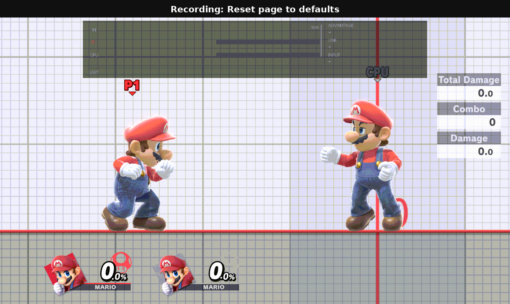

# Recording

Press R twice from the CPU page for your recordings, your combos and their playback options ([Recording guide](../guide/recording.md)).

## The page and its pop-up

 
*The pop-up and the page show the same lists.*

ZR + D-pad Right opens the pop-up over the match ([reading the lists](../guide/recording.md#reading-the-lists)).

| Key | On the page | In the pop-up |
| --- | --- | --- |
| A | Opens the file's own screen. | Acts at once: binds a save, sets a macro active, picks the drill. |
| X | In MACROS, cycles Loop. On an input drill with a take, previews it. | Cycles Loop in MACROS, opens placement on a save, or previews a drill's take. |
| ZR | Switches between the Player view and the CPU view. | Switches the side that Record records. |
| B | Backs out of a file or sublist before closing the menu. | Backs out of DRILLS first; closing the pop-up doesn't reach your fighter. |

## Save states & Macros

<video src="https://git.syntaxbyexample.com/intpa/TrainingRoomsForUltimate/media/blob/35e8edb3e156f65dc2b9cc87b450a10d83e2f8d9" autoplay muted loop playsinline controls></video>

*Record tints Player 1 red.* [Open the clip](../media/tut-record-macro.mp4)

A on a save state, macro or chain opens its own screen ([what each row is for](../guide/recording.md#a-file-s-own-screen)).

| Setting | Values (default in bold) | What it does |
| --- | --- | --- |
| RECORDINGS > | Vault and saved captures | Play one back, or make a macro, a combo or a drill from it. |
| Bind to Save / Load | On, Off | Save writes here; Load uses it unless a [named setup](saves.md#setup-library) is selected. |
| Start save | On, Off | On: warps both fighters to the macro's start save once, before it plays. |
| Momentum | **Keep recorded speed**, Start at rest | The speed the playing side has on its first input. |
| Offset | Only on macros with an old offset | A clears the offset from the start position. |
| Set active | On, Off | On: this view's Play chord plays this macro. |
| Playback slot | None, Slot 1 to 5 | The CPU plays the macro when it picks that slot. Up to 600 frames. [Clip](../media/rc14-playback-slot.gif) |
| Trim | Start, End, Both, Off | Skips neutral frames at those sides in playback. The file is unchanged. |
| Crop | Opens the clip editor | Saves a shorter copy; the original stays ([Crop](../guide/recording.md#crop)). |
| Make combo | Plays once on Player 1 | Hits make a combo. A pass with no hit makes an input drill. |
| + New chain, Edit chain | Opens the numbered picker | A numbers, R removes a number, X finishes, B cancels. |
| Duplicate, Rename, Delete | | Delete removes the file at once, without asking. [Clip](../media/rc13-save-duplicate-delete.gif) |

## Combos & Sequences

<video src="https://git.syntaxbyexample.com/intpa/TrainingRoomsForUltimate/media/blob/b635893c4df02daaae5535f19b5b3f5c2346245b" autoplay muted loop playsinline controls></video>

*The recorded drill appears in the list.* [Open the clip](../media/tut-input-drill-record.mp4)

Player view only: the combos, input drills and sequences that the Combo helper grades ([Combos](../guide/recording.md#combos)).

| Setting | Values | What it does |
| --- | --- | --- |
| + Save last combo… | | Keeps the last combo the frame strip saw and makes it the drill. |
| DRILLS > + Record drill… | | Arms a Player 1 take that needs no hit. Record starts and stops it. |
| + New sequence | Opens the numbered picker | A sequence is combos drilled one after another. |
| Drill, Drill sequence | A selects | Makes this the file the helper grades, replacing the previous choice. |
| Crop | Opens the clip editor | Whole links for a combo, whole steps for a drill. [Clip](../media/rc15-input-drill.gif) |
| X on an input drill | A recorded take is required | Previews the inputs on Player 1. B or X stops it. |

## Replays

<video src="https://git.syntaxbyexample.com/intpa/TrainingRoomsForUltimate/media/blob/23b4e00d007427260ccff3ee35d14c0f976f2e50" autoplay muted loop playsinline controls></video>

*Scrubbing shows each fighter's move.* [Open the clip](../media/tut-clip-scrub-moves.mp4)

[Edit a match capture](../guide/recording.md#crop) or [move a start save's fighters](../guide/recording.md#change-placement-and-the-replay-window).

| Setting | Values (default in bold) | What it does |
| --- | --- | --- |
| Ask before switching fighter | **On**, Off | On: a file recorded on another fighter asks first. Off: your fighter stays. |
| Change placement | Opens the placement picker | Places both fighters of the active macro's start save. |
| Replay window | Opens the clip editor | Pick a saved capture, a fighter and an input window. [Clip](../media/tut-clip-snap.mp4) |
| Replay capture | On, Off | On: saving a replay also captures its inputs. The choice is saved automatically. |
| ZL+L, ZL+R in the clip editor | Player 1, the CPU | Switches between the recorded and original fighters for that side. B cancels early. |
| Scrubbing in the clip editor | The recorded fighter | Stands at its recorded spot and shows its recorded pose. |
| Scrubbing, spot only | A different fighter, or a frame with no stored pose | Stands at the recorded spot only. ZL+L or ZL+R switches to the recorded fighter. |

 
*The clip editor's strip, labelled.* [Open the full-size legend](../diagrams/clip-editor-legend.svg)

## Options

 
*Setting Loop to 3 repeats the macro.*

How a macro plays back, and how the Combo helper grades.

| Setting | Values (default in bold) | What it does |
| --- | --- | --- |
| Trim trailing neutral | Start, **End**, Both, Off | Removes idle frames from those sides of a new take. |
| Place fighters before Record | On, **Off** | On: Record first opens the placement picker. |
| Hitstun timing | **As Hitstun Ends**, As Hitstop Ends, As Hitstop Begins | When playback starts after the CPU is hit. [Clip](../media/rc12-hitstun-timing.gif) |
| Mash interrupts playback | **On**, Off | On: a mash action stops a playing recording. [Clip](../media/rc11-mash-interrupts.gif) |
| Loop | ∞, **1**, 2, 3, 5, 10 | How many times the active macro plays. X cycles it in MACROS. |
| Settings override playback | On, **Off** | Off: a playing recording wins over the DI, SDI, air-dodge, tech and throw settings. |
| Shared start save | **Prompt**, Always change, Always copy | What Change placement does to a start save that several macros share. |
| Combo helper | **On**, Off | On: each attempt is graded under the frame strip, link by link. |
| Match sweet/sour spot | On, **Off** | On: a link counts only if it lands the saved spot. |
| Match angle and deflection | On, **Off** | On: an aimed special must match the saved stick angle and deflection. |
| Move names | On, **Off** | On: moves show their names. Off: the short names. |
| On-time tolerance | Exact, **1 frame**, 2 frames | How far from the recorded press still counts as on time. |
| After an attempt | **Keep playing**, Load save state | Keep playing, or load the save state to retry from the same spot. |
| Show playback indicator | **On**, Off | On: shows which role is playing a recording. |
| Playback delay | **None**, 10 to 120 frames | Frames to wait after the fighters are placed, before the first input. |

## Reset page to defaults

 
*A opens the reset question; A again confirms.*

| Setting | Values | What it does |
| --- | --- | --- |
| Reset page to defaults | A, then confirm | Restores saved settings and resets both Loop counts to 1; Replay capture stays unchanged. |

## Good to know

 
*Green marks the bound save and the active macro.*

| If | Then |
| --- | --- |
| You press B in the numbered picker | Nothing is saved; X finishes the chain. |
| You press X or Y on this page | X never saves your defaults here, and Y does nothing. |
| A file was recorded on another fighter | Play asks first, unless Ask before switching fighter is Off. |
| You reset this page | Your files, the bound save, the active macros and the drill stay. |
| The take has no pose for this frame | Switching fighters cannot show a pose the take did not store. |
